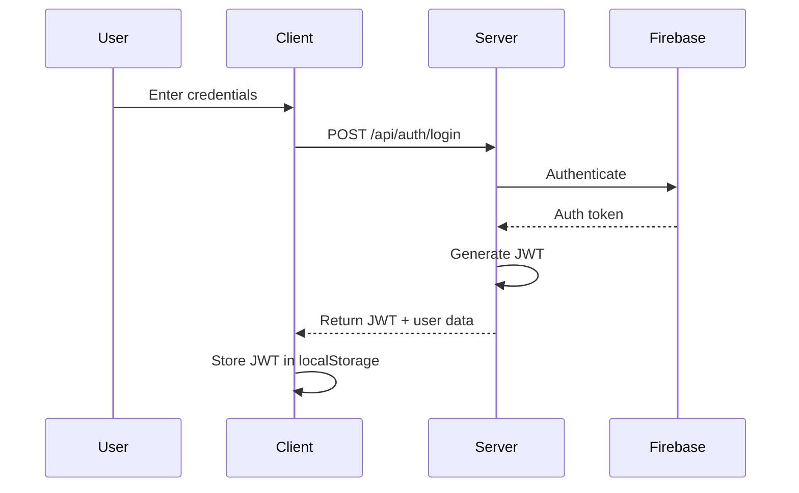
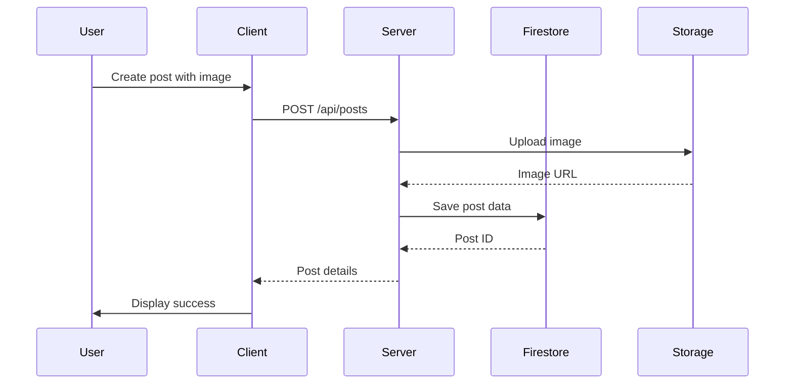

# BlogFire - Modern Firebase-Powered Blogging Platform


## Table of Contents

- [Introduction](#introduction)
- [Features](#features)
- [Technology Stack](#technology-stack)
- [Project Structure](#project-structure)
- [Installation](#installation)
- [Configuration](#configuration)
- [API Documentation](#api-documentation)
- [Backend Architecture](#backend-architecture)
- [Firebase Integration](#firebase-integration)
- [Authentication System](#authentication-system)
- [Post Management](#post-management)
- [User Management](#user-management)
- [File Upload System](#file-upload-system)
- [Error Handling](#error-handling)
- [Responsive Design](#responsive-design)
- [Future Features](#future-features)
- [Contributing](#contributing)
- [License](#license)

## Introduction

BlogFire is a modern, full-stack blogging platform built with Node.js and Firebase. It provides a seamless experience for content creators to publish, manage, and share their blog posts. With robust authentication, real-time updates, and responsive design, BlogFire offers everything needed for a professional blogging experience.

## Features

### Current Features

- **User Authentication**
  - Email/Password registration and login
  - Social media authentication integration
  - JWT-based session management
  - Password reset functionality

- **User Management**
  - Profile creation and editing
  - Avatar uploads
  - User roles (Admin, Author, Reader)
  - User activity tracking

- **Post Management**
  - Create, read, update, delete blog posts
  - Rich text editing
  - Image embedding
  - Draft saving
  - Post categorization and tagging
  - Comments and reactions

- **Content Discovery**
  - Search functionality
  - Category filtering
  - Trending posts
  - Related content suggestions

- **Responsive Design**
  - Mobile-first approach
  - Adaptive layouts
  - Optimized reading experience

## Demo Images

| Description | images |
|-------------|-----------|
| Home Page |  |
| Login Page |  |
| Signup Page |  |
| Explore Public Posts |  |
| Create Posts |  |
| Profile |  |
| Settings |  |

## Technology Stack

### Frontend
- HTML5, CSS3, JavaScript
- Responsive design principles
- Modern CSS features (Flexbox, Grid)

### Backend
- Node.js
- Express.js
- Firebase (Authentication, Firestore, Storage)
- JWT for authentication

### Database
- Firebase Firestore (NoSQL)

### Storage
- Firebase Storage (for images and media)

### Deployment
- Configurable for various hosting platforms

## Project Structure

```
blogfire/
├── .env                    # Environment variables
├── .gitignore              # Git ignore file
├── README.md               # Project documentation
├── config/                 # Configuration files
│   └── firebase.js         # Firebase configuration
├── controllers/            # Request handlers
│   ├── authController.js   # Authentication logic
│   ├── postController.js   # Post management logic
│   └── userController.js   # User management logic
├── middleware/             # Express middleware
│   ├── auth.js             # Authentication middleware
│   └── upload.js           # File upload middleware
├── public/                 # Static assets
│   ├── frontend/           # Frontend code
│   └── uploads/            # Uploaded files
├── routes/                 # API routes
│   ├── auth.js             # Authentication routes
│   └── posts.js            # Post management routes
├── server.js               # Main application entry
└── utils/                  # Utility functions
    ├── errorHandler.js     # Error handling utilities
    ├── firebaseHelper.js   # Firebase helper functions
    ├── responseFormatter.js # Response formatting
    └── validator.js        # Input validation
```

## Installation

### Prerequisites

- Node.js (v14 or higher)
- npm or yarn
- Firebase account

### Setup Steps

1. Clone the repository:

```bash
git clone https://github.com/yourusername/blogfire.git
cd blogfire
```

2. Install dependencies:

```bash
npm install
```

3. Create a `.env` file in the root directory with the following variables:

```
PORT=3000
NODE_ENV=development
JWT_SECRET=your_jwt_secret
FIREBASE_API_KEY=your_firebase_api_key
FIREBASE_AUTH_DOMAIN=your_firebase_auth_domain
FIREBASE_PROJECT_ID=your_firebase_project_id
FIREBASE_STORAGE_BUCKET=your_firebase_storage_bucket
FIREBASE_MESSAGING_SENDER_ID=your_firebase_messaging_sender_id
FIREBASE_APP_ID=your_firebase_app_id
```

4. Start the development server:

```bash
npm run dev
```

## Configuration

### Firebase Setup

1. Create a Firebase project at [Firebase Console](https://console.firebase.google.com/)
2. Enable Authentication, Firestore, and Storage services
3. Create a web app in your Firebase project
4. Copy the configuration details to your `.env` file

## API Documentation

### Authentication Endpoints

| Endpoint | Method | Description | Request Body | Response |
|----------|--------|-------------|-------------|----------|
| `/api/auth/register` | POST | Register a new user | `{ email, password, name }` | `{ token, user }` |
| `/api/auth/login` | POST | Login a user | `{ email, password }` | `{ token, user }` |
| `/api/auth/logout` | POST | Logout a user | None | `{ message }` |
| `/api/auth/me` | GET | Get current user | None | `{ user }` |
| `/api/auth/reset-password` | POST | Request password reset | `{ email }` | `{ message }` |

### Post Endpoints

| Endpoint | Method | Description | Request Body | Response |
|----------|--------|-------------|-------------|----------|
| `/api/posts` | GET | Get all posts | Query params for pagination | `{ posts, pagination }` |
| `/api/posts/:id` | GET | Get a single post | None | `{ post }` |
| `/api/posts` | POST | Create a post | `{ title, content, ... }` | `{ post }` |
| `/api/posts/:id` | PUT | Update a post | `{ title, content, ... }` | `{ post }` |
| `/api/posts/:id` | DELETE | Delete a post | None | `{ message }` |

## Backend Architecture

The application follows the MVC (Model-View-Controller) pattern:

- **Models**: Represented by Firebase Firestore collections
- **Views**: Frontend HTML/CSS/JS
- **Controllers**: Handle business logic and Firebase interactions

### Authentication Flow



### Post Creation Flow



## Firebase Integration

BlogFire leverages Firebase services for various functionalities:

### Authentication

Firebase Authentication provides secure user management with features like:

- Email/password authentication
- Social provider integration
- Password reset
- Email verification

### Firestore Database

The application uses Firestore for storing:

- User profiles
- Blog posts
- Comments
- Categories and tags

### Example Database Schema

#### Users Collection
```
users/
  ├── userId1/
  │   ├── name: "Utso Sarkar"
  │   ├── email: "utsosarkar1@gmail.com"
  │   ├── role: "author"
  │   ├── avatar: "https://storage.url/avatar1.jpg"
  │   └── createdAt: Timestamp
  └── userId2/
      └── ...
```

#### Posts Collection
```
posts/
  ├── postId1/
  │   ├── title: "My First Post"
  │   ├── content: "Content in HTML format"
  │   ├── authorId: "userId1"
  │   ├── imageUrl: "https://storage.url/image1.jpg"
  │   ├── category: "technology"
  │   ├── tags: ["javascript", "firebase"]
  │   ├── published: true
  │   ├── createdAt: Timestamp
  │   └── updatedAt: Timestamp
  └── postId2/
      └── ...
```

### Firebase Storage

Used for storing:
- User avatars
- Post featured images
- Embedded content images

## Authentication System

The authentication system uses JWT tokens for maintaining user sessions:

```javascript
// Example of JWT token generation
const generateToken = (user) => {
  return jwt.sign(
    { uid: user.uid, email: user.email },
    process.env.JWT_SECRET,
    { expiresIn: '7d' }
  );
};
```

## File Upload System

BlogFire includes a robust file upload system using Multer middleware and Firebase Storage:

```javascript
// Example of file upload middleware
const multer = require('multer');
const storage = multer.memoryStorage();
const upload = multer({
  storage,
  limits: { fileSize: 5 * 1024 * 1024 }, // 5MB limit
  fileFilter: (req, file, cb) => {
    if (file.mimetype.startsWith('image/')) {
      cb(null, true);
    } else {
      cb(new Error('Only images are allowed'));
    }
  }
});
```

## Error Handling

The application implements a centralized error handling system:

```javascript
// Example error handler middleware
const errorHandler = (err, req, res, next) => {
  const statusCode = err.statusCode || 500;
  
  res.status(statusCode).json({
    success: false,
    error: {
      message: err.message || 'Server Error',
      stack: process.env.NODE_ENV === 'development' ? err.stack : undefined
    }
  });
};
```

## Responsive Design

The frontend implements responsive design principles:

### Breakpoints

| Device | Width Range | Class Prefix |
|--------|-------------|--------------|
| Mobile | < 768px | `.mobile-` |
| Tablet | 768px - 1023px | `.tablet-` |
| Desktop | 1024px - 1439px | `.desktop-` |
| Large Desktop | ≥ 1440px | `.large-` |

### CSS Features

- Flexbox layout for flexible content arrangement
- CSS Grid for complex page layouts
- CSS Variables for consistent theming
- Media queries for responsive adaptations
- Animations and transitions for enhanced UX

## Future Features

### Planned Enhancements

- **Advanced Analytics**
  - Post view tracking
  - User engagement metrics
  - Conversion tracking

- **Monetization Options**
  - Subscription model
  - Pay-per-view content
  - Affiliate link integration

- **Enhanced Editor**
  - Markdown support
  - Code syntax highlighting
  - Collaborative editing

- **Social Features**
  - User following
  - Activity feed
  - Direct messaging

- **SEO Optimization**
  - Automated meta tags
  - Sitemap generation
  - Schema markup

## Contributing

We welcome contributions to BlogFire! Please follow these steps:

1. Fork the repository
2. Create a feature branch (`git checkout -b feature/amazing-feature`)
3. Commit your changes (`git commit -m 'Add some amazing feature'`)
4. Push to the branch (`git push origin feature/amazing-feature`)
5. Open a Pull Request

## License

This project is licensed under the MIT License - see the LICENSE file for details.

```
MIT License

Copyright (c) 2025 BlogFire

Permission is hereby granted, free of charge, to any person obtaining a copy
of this software and associated documentation files (the "Software"), to deal
in the Software without restriction, including without limitation the rights
to use, copy, modify, merge, publish, distribute, sublicense, and/or sell
copies of the Software, and to permit persons to whom the Software is
furnished to do so, subject to the following conditions:

The above copyright notice and this permission notice shall be included in all
copies or substantial portions of the Software.

THE SOFTWARE IS PROVIDED "AS IS", WITHOUT WARRANTY OF ANY KIND, EXPRESS OR
IMPLIED, INCLUDING BUT NOT LIMITED TO THE WARRANTIES OF MERCHANTABILITY,
FITNESS FOR A PARTICULAR PURPOSE AND NONINFRINGEMENT. IN NO EVENT SHALL THE
AUTHORS OR COPYRIGHT HOLDERS BE LIABLE FOR ANY CLAIM, DAMAGES OR OTHER
LIABILITY, WHETHER IN AN ACTION OF CONTRACT, TORT OR OTHERWISE, ARISING FROM,
OUT OF OR IN CONNECTION WITH THE SOFTWARE OR THE USE OR OTHER DEALINGS IN THE
SOFTWARE.
```

---

© 2025 BlogFire. All rights reserved.
